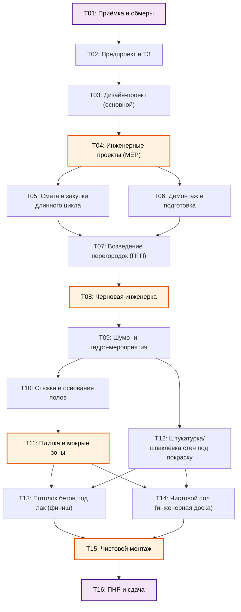
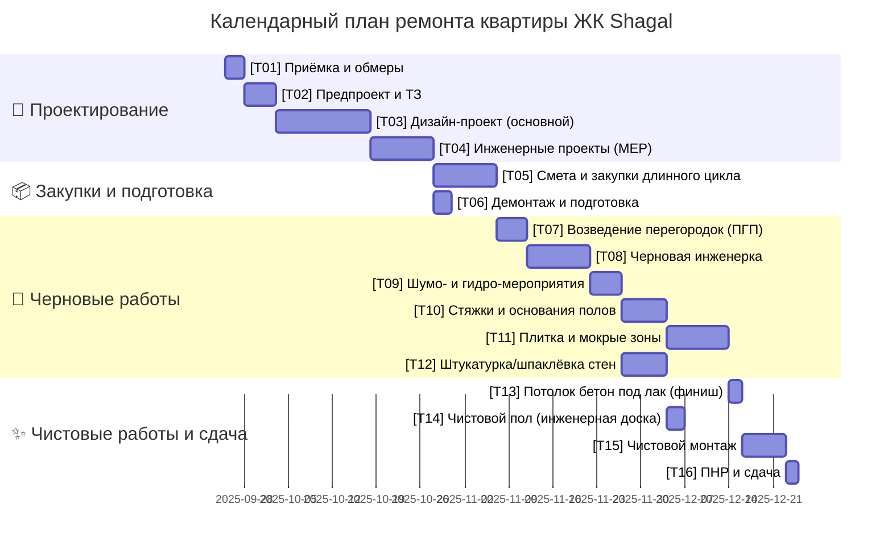
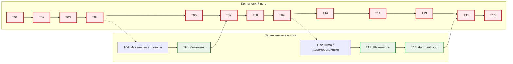
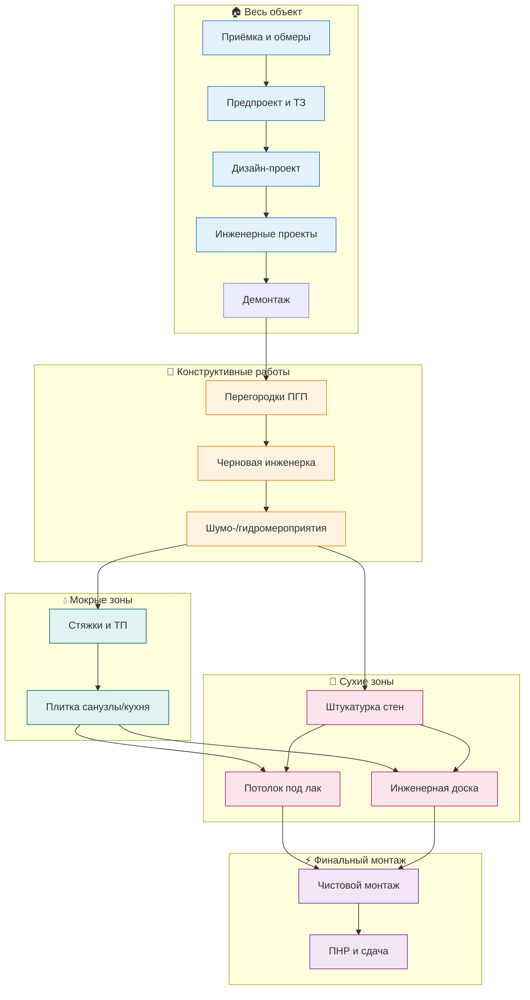

# Диаграммы проекта ремонта квартиры

Визуализация этапов и зависимостей проекта ремонта в ЖК Shagal.

## График зависимостей задач (Graph TD)

## Календарный план работ (Gantt)

## Схема критического пути

## Схема этапов по зонам квартиры

---

## Условные обозначения

- **🎯 Синий** — Проектирование и планирование
- **🧱 Оранжевый** — Конструктивные и черновые работы  
- **💧 Зелёный** — Мокрые процессы (стяжки, плитка)
- **🎨 Розовый** — Сухие отделочные работы
- **⚡ Фиолетовый** — Финальный монтаж и сдача
- **🔶 Красная рамка** — Критический путь проекта

---

_Диаграммы созданы в формате Mermaid для интеграции с GitHub, GitLab, Notion и другими платформами._
